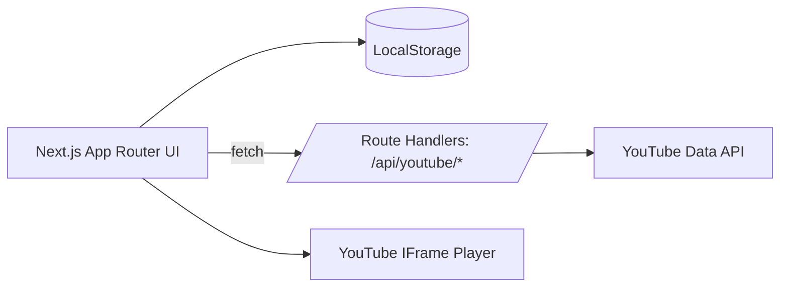
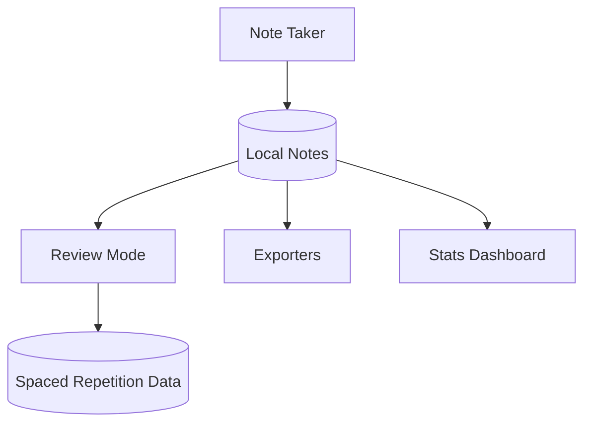

# VexTube

A local-first YouTube learning studio for focused viewing, structured notes, and deliberate review.

## Summary

- Distraction-free player with progress tracking and cinema mode.
- Fast note-taking with timestamps, search, and export.
- Review mode with spaced repetition, plus focus timer and stats.
- Collections and favorites to organize playlists.
- Everything stays on-device by default.

## Features

### Learning Workflow
- Playlist and single video support via URL
- Progress tracking with completion states
- Playback speed presets and fullscreen
- Cinema mode for minimal distractions
- Keyboard shortcuts for core actions

### Notes and Knowledge
- Per-video notes stored locally
- Timestamp capture and jump-to-time
- Live search, filters, and sorting
- Export notes as PDF, TXT, or Markdown

### Review and Focus
- Review mode with spaced repetition ratings
- Focus timer with work and break cycles
- Stats dashboard for completion and notes

### Organization
- Playlist naming prompt on first load
- Collections with favorites and assignment
- Quick open for the current playlist

## Architecture

VexTube is local-first. The only server activity is the YouTube metadata proxy. All learning data, notes, and review state live in the browser.





## Technology Stack

### Framework
- Next.js 16.1.1 (App Router)
- React 19.2.3
- TypeScript 5.x

### Styling
- Tailwind CSS 4.x
- Radix UI primitives

### APIs and Storage
- YouTube Data API v3 via server routes
- LocalStorage for all user data

### Key Libraries
- react-youtube
- react-markdown, rehype-katex
- react-syntax-highlighter
- jsPDF

## Getting Started

### Prerequisites
- Node.js 18.x or higher
- npm, pnpm, yarn, or bun

### Environment Variables

Create a `.env.local` file in the root directory:

```env
# YouTube API (server-side only, do NOT use NEXT_PUBLIC)
YOUTUBE_API_KEY=your_youtube_api_key
```

### Installation

```bash
npm install
```

### Development

```bash
npm run dev
```

### Production Build

```bash
npm run build
npm start
```

### Linting

```bash
npm run lint
```

## Project Structure

```
src/
├── app/
│   ├── api/                  # Server-only route handlers
│   │   └── youtube/          # YouTube API proxy routes
│   ├── page.tsx              # Landing page
│   ├── app/page.tsx          # Main application
│   ├── layout.tsx            # Root layout
│   └── globals.css           # Global styles
├── components/
│   ├── VideoPlayer.tsx       # Player with controls
│   ├── NoteTaker.tsx         # Note-taking interface
│   ├── ReviewMode.tsx        # Spaced repetition review
│   ├── CollectionManager.tsx # Playlist organization
│   ├── FocusTimer.tsx        # Pomodoro timer
│   ├── StatsDashboard.tsx    # Progress stats
│   └── ui/                   # Radix UI wrappers
└── lib/
    ├── youtube.ts            # YouTube client (server routes)
    ├── storage.ts            # LocalStorage utilities
    ├── notes.ts              # Note loading helpers
    └── types.ts              # TypeScript definitions
```

## Data Storage

All data is stored locally in the browser:
- Video progress and completion state
- Playback settings and player position
- Notes, timestamps, and review ratings
- Collections, favorites, and playlist metadata

## Performance Notes

- Lazy-loaded YouTube player
- Throttled LocalStorage writes
- Memoized components for large lists

## Known Limitations

- YouTube API has daily quota limits
- LocalStorage is typically limited to 5 to 10MB

## License

MIT
